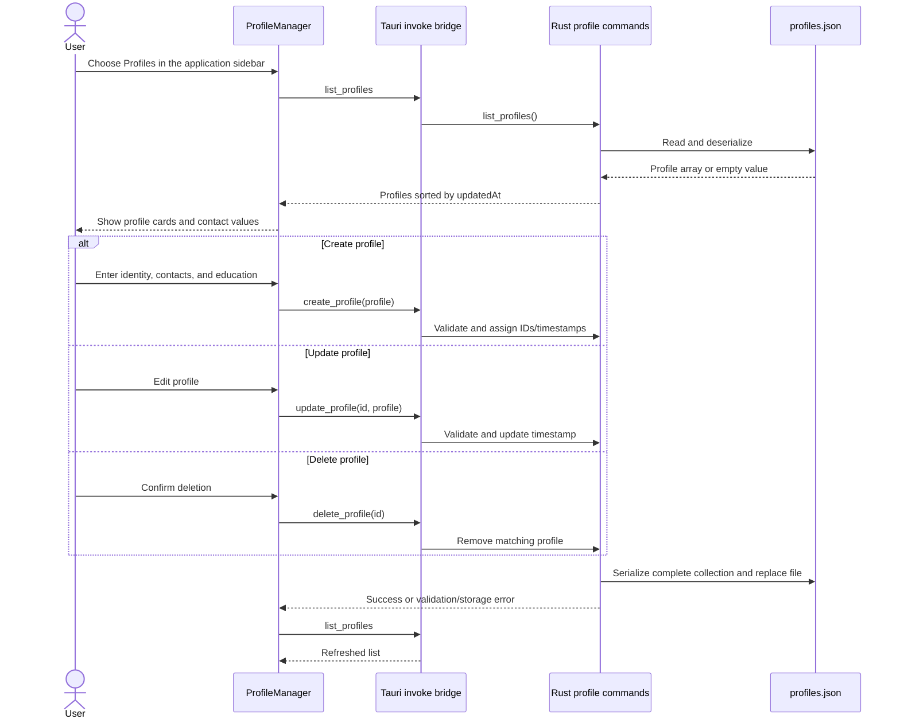
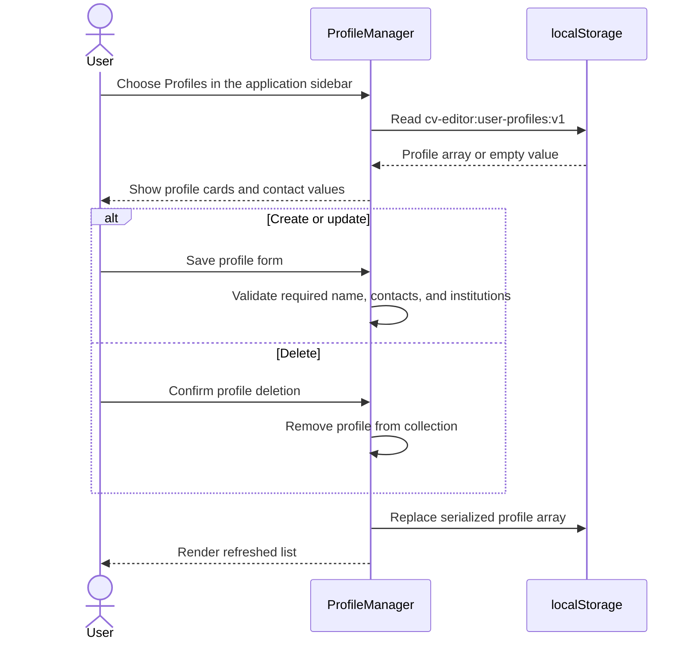

# Profile Management

Last updated: main | 2026-09-14

## Scope

This spec covers reusable user identity profiles in:

- `src/components/AppSidebar.tsx`, `AppSidebar.css`, `ProfileManager.tsx`, and `ProfileManager.css`;
- `src/types/profile.ts`;
- Tauri commands and persistence in `src-tauri/src/lib.rs`;
- the browser-build storage fallback.

A profile contains a full name, optional headline and summary, education entries, and contact entries. Contact kinds are `phone`, `email`, `address`, and `social`. Profile cards show every contact kind and value directly in the list.

The left application sidebar switches between the CV editor and Profiles. Profiles render as a full-workspace page rather than a modal; returning to the editor preserves the application document state.

Profile data is independent from Markdown/CSS projects. Creating or editing a profile does not modify the currently open CV.

## Storage Ownership

The Tauri desktop build detects `__TAURI_INTERNALS__`/`__TAURI__` and uses only core commands for profile operations. Rust owns validation, identifiers, timestamps, sorting, and persistence in `~/Documents/cv-editor/profiles.json`. Writes serialize the complete profile collection to a temporary file and rename it into place.

The ordinary web build does not invoke a server. `ProfileManager` reads and replaces the profile array in browser `localStorage` under `cv-editor:user-profiles:v1`. Consequently, web profiles are local to one browser storage origin and are not synchronized across browsers or devices.

## Desktop Profile Sequence

## Web Profile Sequence

## Validation And Failure Behavior

- Full name is required and limited to 120 characters in the Rust backend.
- Contact values are required and contact kinds must be one of the four supported kinds.
- Every education entry requires an institution.
- Rust assigns missing contact and education IDs and preserves supplied IDs on updates.
- A missing profile update or deletion returns `profile not found`.
- The UI displays create/update errors. Profile deletion requires browser confirmation.
- Invalid browser JSON is treated as an empty collection; a Rust read or deserialize failure currently also yields an empty collection.

## Current Gaps

- Profiles cannot yet populate or merge fields into the open CV source.
- There is no import/export, cross-device sync, profile selection on a project, or schema migration.
- The profile collection has no encryption or OS keychain integration and can contain personal data.
- There is no automated CRUD, malformed-storage, or migration test coverage.
